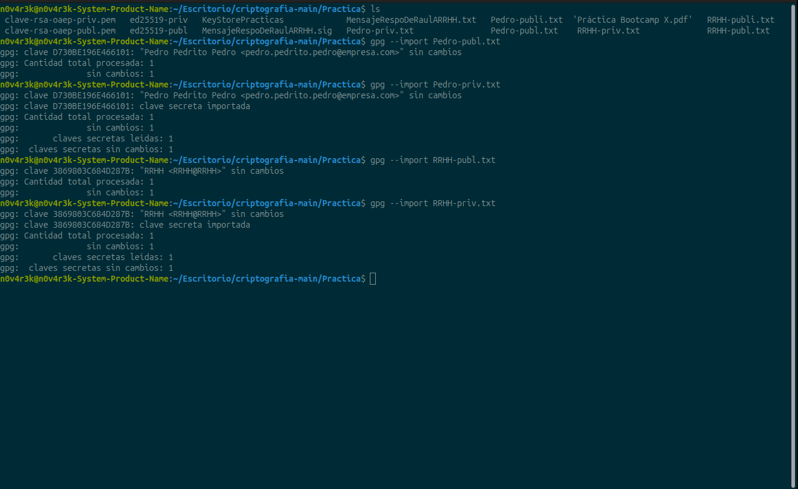
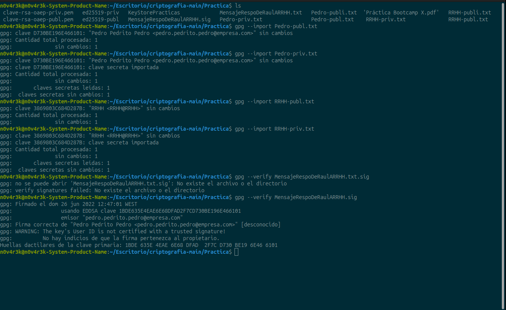
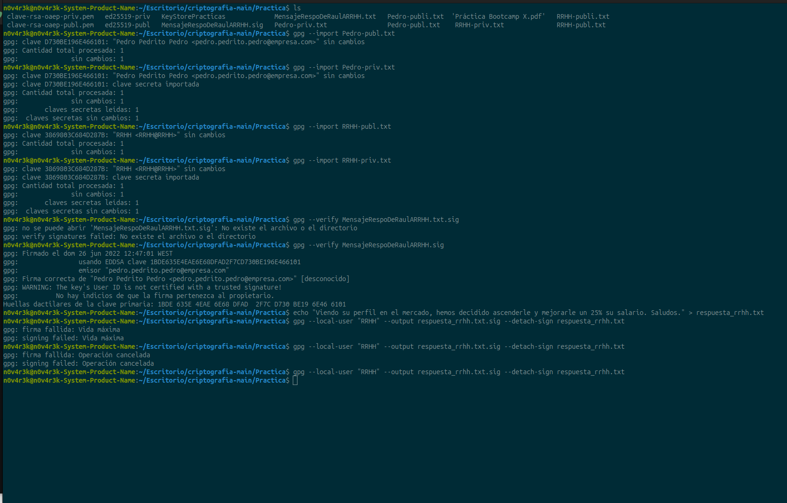
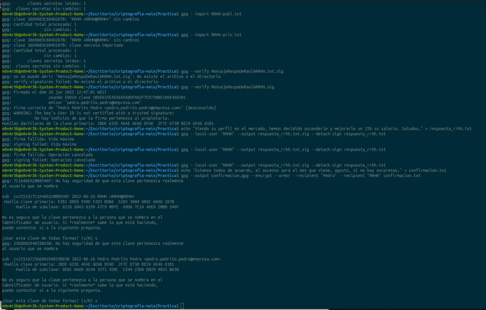
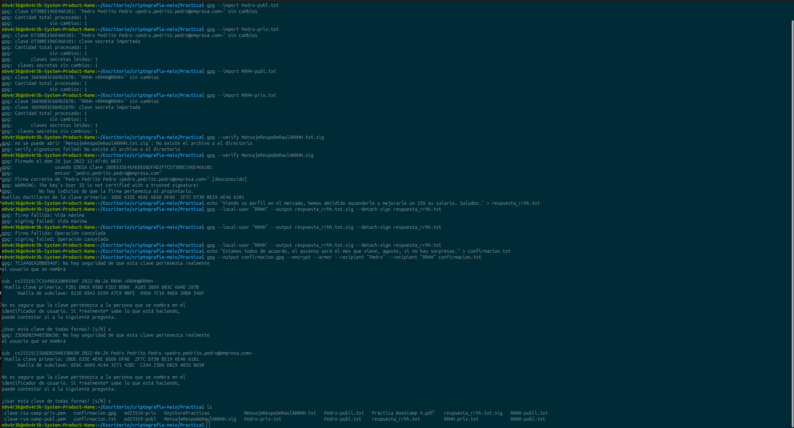

# Ejercicio 10: Práctica GPG - Entregables

Hola, aquí dejo la documentación de la práctica. Es la primera vez que realizo el flujo completo de criptografía con GPG en la terminal, así que he ido documentando cada paso con capturas para asegurarme de no perder el hilo.

A continuación detallo los pasos que he seguido y el resultado de cada uno.

### 1. Preparación de las claves
Lo primero fue importar todas las claves al anillo (keyring).
* He importado las claves públicas y privadas tanto de Pedro como de RRHH.
* La terminal me confirmó "sin cambios" o "leídas" en los 4 casos.
* Aquí dejo la captura del proceso:

---

### 2. Verificación de la firma (Paso 1)
El objetivo era verificar que el mensaje de Pedro fuese auténtico.
* **Nota:** Al principio me equivoqué y escribí el nombre del archivo terminado en `.txt.sig` (se ve el error en la captura), pero me di cuenta de que el archivo real era solo `.sig`.
* Al corregirlo, obtuve el mensaje **"Firma correcta"**.

---

### 3. Firmar la respuesta de RRHH (Paso 2)
Aquí tuve que generar la respuesta y firmarla digitalmente.
* Me costó un poco porque la terminal me dio varios errores de "signing failed" u "operación cancelada" (creo que me lie seleccionando el usuario local "RRHH").
* Se pueden ver mis intentos fallidos en la siguiente imagen, hasta que finalmente di con la tecla.

* Finalmente, logré generar el archivo de firma correctamente.

---

### 4. Cifrado del mensaje final (Paso 3)
Por último, cifré el mensaje de confirmación para los dos destinatarios (Pedro y RRHH).
* Al ejecutar el comando, GPG me lanzó unas advertencias de seguridad ("No hay seguridad de que esta clave pertenezca...").
* Como se ve en la captura, tuve que escribir "s" (sí) dos veces para confirmar que confiaba en las claves y proceder con el cifrado.

* Al final, hice un `ls` para comprobar que todos los archivos requeridos (`confirmacion.gpg`, `respuesta_rrhh.txt.sig`) se habían creado bien en la carpeta.

---

### Resumen de la entrega
En esta carpeta entrego:
1.  **`respuesta_rrhh.txt.sig`**: La firma digital generada.
2.  **`confirmacion.gpg`**: El archivo cifrado final.
3.  Este documento con las capturas de evidencia del proceso.

Un saludo.
