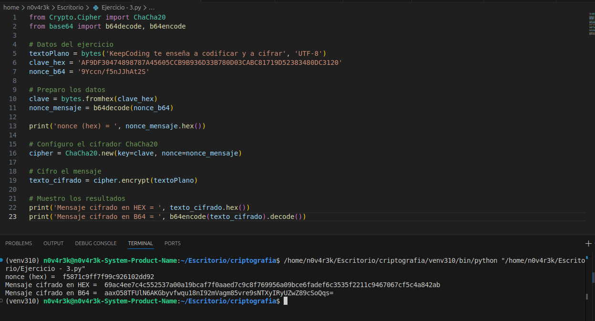

# Ejercicio 3 – Cifrado de Flujo ChaCha20 y Autenticación Poly1305

Este ejercicio se centra en el uso de cifrado de flujo con **ChaCha20**. Se divide en dos partes:
1.  Cifrado básico para confidencialidad.
2.  Mejora del sistema añadiendo **integridad** y autenticación con **Poly1305**.

---

## 🔹 Parte 1: Cifrado con ChaCha20

### Enunciado
Se requiere cifrar el texto: `"KeepCoding te enseña a codificar y a cifrar"`.
* **Clave:** Etiqueta en Keystore “cifrado-sim-chacha-256”.
* **Nonce:** `9Yccn/f5nJJhAt2S`.
* **Algoritmo:** ChaCha20.

### 📌 Captura de ejecución (Parte 1)


### 💻 Código Parte 1

```python
from Crypto.Cipher import ChaCha20
from base64 import b64decode, b64encode

# Datos del ejercicio
textoPlano = bytes('KeepCoding te enseña a codificar y a cifrar', 'UTF-8')
clave_hex = 'AF9DF30474898787A45605CCB9B936D33B780D03CABC81719D52383480DC3120'
nonce_b64 = '9Yccn/f5nJJhAt2S'

# Preparo los datos
clave = bytes.fromhex(clave_hex)
nonce_mensaje = b64decode(nonce_b64)

print('nonce (hex) = ', nonce_mensaje.hex())

# Configuro el cifrador ChaCha20
cipher = ChaCha20.new(key=clave, nonce=nonce_mensaje)

# Cifro el mensaje
texto_cifrado = cipher.encrypt(textoPlano)

# Muestro los resultados
print('Mensaje cifrado en HEX = ', texto_cifrado.hex())
print('Mensaje cifrado en B64 = ', b64encode(texto_cifrado).decode())
🔹 Parte 2: Propuesta de Mejora (Integridad)
Pregunta
¿Cómo podríamos mejorar de forma sencilla el sistema para garantizar no solo la confidencialidad, sino también la integridad del mismo?

Solución Propuesta
Para garantizar la integridad y autenticidad, debemos usar un modo de operación que soporte AEAD (Authenticated Encryption with Associated Data). La implementación correcta es utilizar ChaCha20-Poly1305. Esto nos genera un TAG (MAC) que permite verificar si el mensaje ha sido manipulado.

Nota: En esta implementación usamos get_random_bytes(12) para el nonce, ya que nunca debe repetirse para la misma clave.

📌 Captura de ejecución (Parte 2 - Poly1305)
💻 Código Parte 2 (Mejora)
from Crypto.Cipher import ChaCha20_Poly1305
from base64 import b64decode, b64encode
from Crypto.Random import get_random_bytes


textoPlano = bytes('KeepCoding te enseña a codificar y a cifrar', 'UTF-8')
# Se requiere o 256 o 128 bits de clave, por ello usamos 256 bits (64 hex)
clave = bytes.fromhex('AF9DF30474898787A45605CCB9B936D33B780D03CABC81719D52383480DC3120')

# Importante: NUNCA debe fijarse el nonce en producción
nonce_mensaje = get_random_bytes(12)

# Datos asociados (header) que queremos firmar pero no cifrar (vacío en este caso)
datos_asociados = bytes('', 'utf-8')

# Configuración del cifrador autenticado
cipher = ChaCha20_Poly1305.new(key=clave, nonce=nonce_mensaje)
cipher.update(datos_asociados)

# Cifrado y generación del TAG (MAC)
texto_cifrado, tag = cipher.encrypt_and_digest(textoPlano)

print("nonce:", b64encode(nonce_mensaje).decode())
print("Datos asociados", b64encode(datos_asociados).decode())
print("Texto cifrado:", b64encode(texto_cifrado).decode())
print("MAC/Tag:", b64encode(tag).decode())
